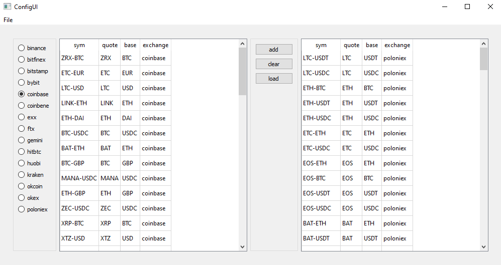

# cryptoq
stores streaming trade and quote data from cryptofeed to kdb+

Requirements:
* python>=3.6
* 32-bit or 64-bit version of kdb+ https://kx.com/connect-with-us/download/
* [qpython](https://github.com/exxeleron/qPython.git) qpython (python library to interact with q)
* [pyzmq](https://github.com/zeromq/pyzmq.git)
* [cryptofeed](https://github.com/bmoscon/cryptofeed) (stream cryptocurrency market data)
* [ccxt](https://github.com/ccxt/ccxt) (reference data)

# Getting Started
Configure the conf/subscriptions.yaml config file with exchange as key and list of products as value. You can use the pre-existing file out of the box.
example:
```yaml
coinbase:
    - BTC-USD
    - LTC-USD
kraken:
    - BTC-USD
    - LTC-USD
```
Or you can use the config ui:
```shell
start_config_ui.bat
```
<p align="center">
  
</p>

In the command prompt, first start q instance specifiying port and load.q file. This file will loads table schemas and functions to the q session.
```shell
q.exe q/load.q -p 5002
```
To see all table names loaded into q session:
```q
q)tables[]
`quotes`refdata`trades
```
To see all functions loaded into q session:
```q
q)\f
`getCandlestick`getLastTrade`getSymList`jjoin`out`syncmd
```
In command prompt, change to cryptoq directory and run bin/cryptoq.py script with arguments.
```shell
python -m bin.cryptoq --q-port 5002 --kdb-port 5555 --gui-port 5556 --depth 1 --config conf\subscriptions.yaml
```
or if using Windows:
```shell
start_md.bat
```
In the q window, you can see trades and quotes data:
```q
q)trades
utc_datetime                  exch_datetime                 exch     sym      side amount     price    tradeid
---------------------------------------------------------------------------------------------------------------
2019.07.17D22:03:28.561529000 2019.07.17D17:03:24.427000000 COINBASE EOS-USD  sell 42.8       3.956    396979  
2019.07.17D22:03:28.760387000 2019.07.17D17:03:24.641000000 COINBASE ETH-USD  buy  5          215.52   50223672
2019.07.17D22:03:28.762372000 2019.07.17D17:03:24.641000000 COINBASE ETH-USD  buy  15.61874   215.53   50223673
2019.07.17D22:03:29.105701000 2019.07.17D17:03:24.987000000 COINBASE ETH-USD  buy  5          215.52   50223674
2019.07.17D22:03:29.196769000 2019.07.17D17:03:25.760000000 COINBASE DAI-USDC sell 6.03765    0.992532 147320  
2019.07.17D22:03:29.279228000 2019.07.17D17:03:25.152000000 COINBASE BTC-USD  sell 0.01056728 9860     70194746
2019.07.17D22:03:30.065150000 2019.07.17D17:03:25.939000000 COINBASE BTC-USD  buy  0.05440595 9864.39  70194747
2019.07.17D22:03:30.524360000 2019.07.17D17:03:26.405000000 COINBASE XRP-USD  buy  67         0.315    2431849 
2019.07.17D22:03:30.704920000 2019.07.17D17:03:26.580000000 COINBASE LTC-BTC  sell 1.1969     0.009416 6068676 
2019.07.17D22:03:31.379680000 2019.07.17D17:03:27.259000000 COINBASE DAI-USDC sell 22.06721   0.992532 147321  
2019.07.17D22:03:32.061706000 2019.07.17D17:03:27.921000000 COINBASE LINK-USD buy  38.8       2.4657   581567 

q)quotes
utc_datetime                  exch_datetime                 exch     sym      bsize      bid        ask        asize    
------------------------------------------------------------------------------------------------------------------------
2019.07.18D23:11:50.343151000 2019.07.18D18:11:49.920316000 COINBASE ZRX-BTC  4103.811   2.244e-005 2.25e-005  6292.148 
2019.07.18D23:11:50.347144000 2019.07.18D18:11:49.929257000 COINBASE BTC-USDC 1.281527   10649.47   10660.17   0.1716854
2019.07.18D23:11:50.348136000 2019.07.18D18:11:49.932251000 COINBASE BTC-USD  0.00234715 10651.21   10659.03   0.621531 
2019.07.18D23:11:50.349134000 2019.07.18D18:11:49.933245000 COINBASE BTC-USD  0.00234715 10651.21   10659.03   0.621531 
2019.07.18D23:11:50.350131000 2019.07.18D18:11:49.934245000 COINBASE LINK-USD 1310.99    2.67597    2.67997    8.45     
2019.07.18D23:11:50.351136000 2019.07.18D18:11:49.942233000 COINBASE BTC-USD  0.1663128  10651.21   10659.03   0.621531 
2019.07.18D23:11:50.352127000 2019.07.18D18:11:49.966159000 COINBASE XLM-USD  1061       0.088705   0.08872    51574    
2019.07.18D23:11:50.353123000 2019.07.18D18:11:49.967157000 COINBASE ETC-USD  269.7492   6.031      6.04       50       
2019.07.18D23:11:50.354121000 2019.07.18D18:11:49.968154000 COINBASE LINK-USD 1310.99    2.67597    2.67997    8.45     
2019.07.18D23:11:50.355119000 2019.07.18D18:11:49.983112000 COINBASE BTC-USD  0.1663128  10651.21   10659.03   0.621531 
```


